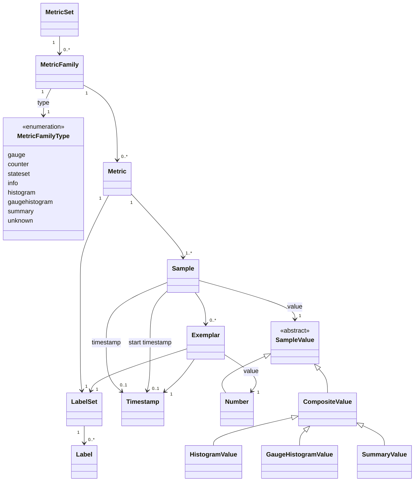

- Version: 2.0.0-rc0
- Status: Draft
- Date: TBD
- Authors: Arthur Silva Sens, Bartłomiej Płotka, David Ashpole, György Krajcsovits, Owen Williams, Richard Hartmann
- Emeritus: Ben Kochie, Brian Brazil, Rob Skillington

Created in 2012, Prometheus has been the default for cloud-native observability since 2015. A central part of Prometheus' design is its text metric exposition format, called the Prometheus exposition format 0.0.4, stable since 2014. In this format, special care has been taken to make it easy to generate, to ingest, and to understand by humans. As of 2020, there are more than 700 publicly listed exporters, an unknown number of unlisted exporters, and thousands of native library integrations using this format. Dozens of ingestors from various projects and companies support consuming it.

In 2020, [OpenMetrics 1.0](open_metrics_spec.md) was released to clean up and tighten the specification with the additional purpose of bringing it into IETF. OpenMetrics 1.0 text exposition documented a working standard with wide and organic adoption among dozens of exporters, integrations, and ingestors.

Around 2024, the OpenMetrics project was incorporated under the CNCF Prometheus project umbrella. Together with production learnings from deploying OpenMetrics 1.0 on wide scale and a backlog of new Prometheus innovations missing from the text formats, Prometheus community decided to pursue a second version of the OpenMetrics standard.

The intention of OpenMetrics 2.0 is to use OpenMetrics 1.0 as a foundation and enhance it to achieve even greater reliability, usability and consistency with the modern Prometheus data model, without sacrificing the ease of use and readability. OpenMetrics 2.0 also improves compatibility with OpenTelemetry data model and naming conventions.

This document is meant to be used as a standalone specification.

> NOTE: This is a release candidate (RC) version of the OpenMetrics 2.0 specification. This means that this specification is currently in an experimental state--no major changes are expected, but we reserve the right to break the compatibility if it's necessary, based on the early adopters' feedback. The potential feedback, questions and suggestions should be added as [an issue on the `prometheus/openmetrics` repository](https://github.com/prometheus/openmetrics).

## Overview

Metrics are a specific kind of telemetry data. They represent a snapshot of the current state for a set of data. They are distinct from logs or events, which focus on records or information about individual events.

OpenMetrics is primarily a wire format, independent of any particular transport for that format. The format is expected to be consumed on a regular basis and to be meaningful over successive expositions.

Implementers SHOULD expose metrics in the OpenMetrics text format in response to an HTTP GET request to a documented URL for a given process or device. This endpoint SHOULD be called "/metrics". Implementers MAY also expose OpenMetrics formatted metrics in other ways, for example, by regularly pushing metric sets to an operator-configured endpoint over HTTP.

### Metrics and Time Series

This standard expresses all system states as numerical values; counts, current values, distributions, enumerations, and boolean states being common examples. Contrary to metrics, singular events occur at a specific time. Metrics tend to aggregate data temporally and provide a sample of the system state. While this can lose information, the reduction in overhead is an engineering trade-off commonly chosen in many modern monitoring systems.

Time series are a record of changing information over time. Common examples of metric time series would be network interface counters, device temperatures, BGP connection states, latency distributions, and alert states.

## Normative Language

The key words "MUST", "MUST NOT", "REQUIRED", "SHALL", "SHALL NOT", "SHOULD", "SHOULD NOT", "RECOMMENDED", "NOT RECOMMENDED", "MAY", and "OPTIONAL" in this document are to be interpreted as described in [RFC 2119](https://www.rfc-editor.org/rfc/rfc2119) and [RFC 8174](https://www.rfc-editor.org/rfc/rfc8174) when, and only when, they appear in all capitals, as shown here.

The word "RESERVED" is used in this document to designate values, names, or fields that are set aside for future use or for use by this standard itself. Values, names, or fields described as "RESERVED" MUST NOT be used unless explicitly permitted by this standard or a future version thereof.

## Data Model

This section MUST be read together with the ABNF section. In case of disagreements between the two, the ABNF's restrictions MUST take precedence.



### Data Types

#### Sample Values

Metric values in OpenMetrics MUST be either Number or CompositeValue.

##### Number

Number value MUST be either floating point or integer. Note that ingestors of the format MAY only support float64. The non-real values NaN, +Inf and -Inf MUST be supported. NaN value MUST NOT be considered a missing value, but it MAY be used to signal a division by zero.

Booleans MUST be represented as a Number value where `1` is true and `0` is false.

##### CompositeValue

CompositeValue MUST contain all information necessary to recreate a sample value for Metric within the MetricFamily.

The following MetricFamily Types MUST use CompositeValue for Metric Values:

* [Histogram](#histogram) MetricFamily Type.
* [GaugeHistogram](#gaugehistogram) MetricFamily Type.
* [Summary](#summary) MetricFamily Type.

Other MetricFamily Types MUST use Numbers.

#### Timestamps

Timestamps MUST be Unix Epoch in seconds. Timestamps SHOULD be floating point to represent sub-second precision, for example milliseconds or microseconds. Negative timestamps MAY be used.

#### Strings

Strings MUST only consist of valid UTF-8 characters and MAY be zero length. NULL (ASCII 0x0) MUST be supported.

#### Label

Labels are key-value pairs consisting of strings.

Label names beginning with one or more underscores are RESERVED and MUST NOT be used unless specified by this standard. Such Label names MAY be used in place of TYPE and UNIT metadata in cases where MetricFamilies' metadata might otherwise be conflicting, such as metric federation cases.

Label names SHOULD follow the restrictions in the ABNF section under the `label-name` section. Label names MAY be any quoted escaped UTF-8 string as described in the ABNF section. Be aware that exposing UTF-8 metrics may reduce usability.

Empty label values SHOULD be treated as if the label was not present.

#### LabelSet

A LabelSet MUST consist of Labels and MAY be empty. Label names MUST be unique within a LabelSet.

#### Exemplars

Exemplars are references to data outside of the MetricSet. A common use case are IDs of program traces.

Exemplars MUST consist of a LabelSet and a Number value, and MUST have a timestamp. The LabelSet SHOULD NOT contain any Label names included in the Metric's LabelSet. The timestamp SHOULD be before or equal to the Sample's timestamp, if present. The timestamp SHOULD be after or equal to the Sample's start timestamp, if present. Exemplars of a Sample SHOULD have the same Label names to have a consistent style.

The Exemplar's timestamp SHOULD be close to the point when it was observed, but doesn't have to be exact. For example, if getting an exact timestamp is costly, it is acceptable to use some external source or an estimate.

When an exemplar references a [Trace Context](https://www.w3.org/TR/trace-context-2/), it SHOULD use the `trace_id` key for the [trace-id](https://www.w3.org/TR/trace-context-2/#traceparent-header) field, and the `span_id` key for the [`parent-id`](https://www.w3.org/TR/trace-context-2/#traceparent-header) field.

While there's no [hard limit](#size-limits) specified, Exemplar's LabelSet SHOULD NOT be used to transport large data like tracing span details or other event logging.

Ingestors MAY truncate the Exemplar's LabelSet or discard Exemplars. When truncating the Exemplar's LabelSet the `trace_id` and `span_id` SHOULD be preserved even after truncation.

#### Sample

A Sample is a single data point within a Metric. It MUST have a Value, MAY have a Timestamp. It MAY include Exemplars and MAY have a start timestamp, depending on the MetricFamily Type.

Samples SHOULD NOT have explicit timestamps.

#### Metric

Metrics are defined by a unique LabelSet within a MetricFamily. Metrics MUST contain a list of one or more Samples. If more than one Sample is exposed for a Metric, then its Samples MUST have monotonically increasing Timestamps.

Metrics with the same name for a given MetricFamily SHOULD have the same set of label names in their LabelSet.

#### MetricFamily

A MetricFamily MAY have zero or more Metrics. Every Metric within a MetricFamily MUST have a unique LabelSet. A MetricFamily MUST have a name and SHOULD have Help, Type, and Unit metadata.

##### Name

MetricFamily name:

* MUST be string.
* MUST be unique within a MetricSet.
* MUST be the same as every Metric's Name in the family.

> NOTE: [OpenMetrics 1.0](https://prometheus.io/docs/specs/om/open_metrics_spec/#suffixes) required mandatory suffixes for MetricName and a matching MetricFamily name without such suffixes. To improve parser reliability (i.e. matching [MetricFamily metadata](#metricfamily-metadata)) and future compatibility, this specification requires Metric name to strictly match its MetricFamily name.

Names SHOULD be in snake_case. Names SHOULD follow the restrictions in the ABNF section under `metricname`. MetricFamily names MAY be any quoted and escaped UTF-8 string as described in the ABNF section. Be aware that exposing UTF-8 metrics may reduce usability, especially when `_total` or unit suffixes are not included in the names.

Colons in MetricFamily names are RESERVED to signal that the MetricFamily is the result of a calculation or aggregation of a general purpose monitoring system.

MetricFamily names beginning with one or more underscores are RESERVED and MUST NOT be used unless specified by this standard.

###### Discouraged Suffixes

MetricFamily name SHOULD NOT end with `_count`, `_sum`, `_gcount`, `_gsum`, `_bucket`. Specifically, a name SHOULD NOT create a MetricName collision when converted to [the OpenMetrics 1.0 Text](https://prometheus.io/docs/specs/om/open_metrics_spec). Ingestors MAY reject such MetricFamily.

A non-compliant example would be a gauge called `foo_bucket` and a histogram called `foo`. Exposers negotiating the older OpenMetrics or Text formats, or ingestors which support only the older data model could end up storing the `foo` histogram in the classic representation (`foo_bucket`, `foo_count`, `foo_sum`), which would clash with the gauge and cause a scrape rejection or dropped data.

> This rule exists because this specification is following a shift in Prometheus ecosystem towards [composite values](#compositevalues) instead of [the "classic" representation](https://prometheus.io/docs/specs/om/open_metrics_spec/#histogram-1). However, this transformation will take time. Avoiding such suffixes improves compatibility with older ingestors and the eventual migration process.

##### Type

Type specifies the MetricFamily type. Valid values are "unknown", "gauge", "counter", "stateset", "info", "histogram", "gaugehistogram", and "summary".

##### Unit

Unit specifies MetricFamily units. If non-empty, it SHOULD be a suffix of the MetricFamily name separated by an underscore. Further type specific suffixes come after the unit suffix. Exposing metrics without the unit being a suffix of the MetricFamily name directly to end-users may reduce the usability due to confusion about what the metric's unit is. For recommended unit values see [Units and Base Units](#units-and-base-units).

##### Help

Help is a string and SHOULD be non-empty. It is used to give a brief description of the MetricFamily for human consumption and SHOULD be short enough to be used as a tooltip.

##### MetricSet

A MetricSet is the top level object exposed by OpenMetrics. It MUST consist of MetricFamilies and MAY be empty.

Each MetricFamily name MUST be unique. The same label name and value SHOULD NOT appear on every Metric within a MetricSet.

There is no specific ordering of MetricFamilies required within a MetricSet. An exposer MAY make an exposition easier to read for humans, for example sort alphabetically if the performance tradeoff makes sense.

If present, an Info MetricFamily called "target_info" per the [Supporting target metadata in both push-based and pull-based systems](#supporting-target-metadata-in-both-push-based-and-pull-based-systems) section below SHOULD be first.

### MetricFamily Types

#### Gauge

Gauges are current measurements, such as bytes of memory currently used or the number of items in a queue. For gauges the absolute value is what is of interest to a user.

A Sample in a Metric with the Type gauge MUST have a Number value.

Gauges MAY increase, decrease, or stay constant over time. Even if they only ever go in one direction, they might still be gauges and not counters. The size of a log file would usually only increase, a resource might decrease, and the limit of a queue size may be constant.

#### Counter

Counters measure discrete events. Common examples are the number of HTTP requests received, CPU seconds spent, or bytes sent. For counters how quickly they are increasing over time is what is of interest to a user.

The MetricFamily name for Counters SHOULD end in `_total`. Exposing metrics without a `_total` suffix may reduce the usability due to confusion about what the metric's Type is.

A Sample in a Metric with the Type Counter SHOULD have a Timestamp value called Start Timestamp. This can help ingestors discern between new metrics and long-running ones it did not see before.

A Sample in a Metric with the Type Counter MUST have a Number value which is non-NaN. The value MUST be monotonically non-decreasing over time, unless it is reset to 0, and start from 0. The value MAY reset its value to 0. If present, the corresponding Start Timestamp MUST also be set to the timestamp of the reset.

A Sample in a Metric with the type Counter MAY have exemplars.

#### StateSet

StateSets represent a series of related boolean values, also called a bitset. If ENUMs need to be encoded this MAY be done via StateSet.

A StateSet is structured as a set of Metrics, one for each state, called a StateSet MetricGroup.

> NOTE: In OpenMetrics 1.0, Metrics are composed of MetricPoints (e.g. a Histogram metric has a MetricPoint representing each Bucket with a special "le" label), which is no longer the case in OpenMetrics 2.0. An OpenMetrics 1.0 StateSet Metric is equivalent to an OpenMetrics 2.0 StateSet MetricGroup, and an OpenMetrics 1.0 StateSet MetricPoint is equivalent to an OpenMetrics 2.0 StateSet Metric.

A StateSet MetricGroup contains one or more states and MUST contain one Metric with a boolean value per state. States have a name which is a String.

If encoded as a StateSet, ENUMs MUST have exactly one Sample which is `1` (true) within a MetricGroup, for a single Timestamp.

This is suitable where the enum value changes over time, and the number of States isn't much more than a handful.

MetricFamilies of Type StateSets MUST have an empty Unit string.

#### Info

Info metrics are used to expose textual information which SHOULD NOT change during process lifetime. Common examples are an application's version, revision control commit, and the version of a compiler.

The MetricFamily name for Info metrics MUST end in `_info`.

MetricFamilies of Type Info MUST have an empty Unit string.

#### Histogram

Histograms measure distributions of discrete events. Common examples are the latency of HTTP requests, function runtimes, or I/O request sizes.

A Histogram Sample MUST contain Count and Sum.

The Count value MUST be equal to the number of measurements taken by the Histogram. The Count is a counter semantically. The Count SHOULD be an integer. The Count MUST NOT be negative. The Count SHOULD NOT be +Inf, NaN.

Float Count is allowed to make it possible to expose results of arithmetic operations on histograms, such as addition that may result in values beyond the range of integers.

The Sum value MUST be equal to the sum of all the measured event values. The Sum is only a counter semantically as long as there are no negative event values measured by the Histogram.

A Histogram MUST measure values that are not NaN in either [Classic Buckets](#classic-buckets) or [Native Buckets](#native-buckets) or both. Measuring NaN is different for Classic and Native Buckets, see in their respective sections.

Every Bucket MUST have well-defined boundaries and a value. The bucket value is called the bucket count colloquially. Boundaries of a Bucket MUST NOT be NaN. Bucket values are counters semantically. Bucket values SHOULD be integers. Bucket values MUST NOT be negative. Bucket values SHOULD NOT be +Inf, NaN.

Float bucket values are allowed to make it possible to expose results of arithmetic operations on histograms, such as addition that may result in values beyond the range of integers.

A Histogram SHOULD NOT include NaN measurements as including NaN in the Sum will make the Sum equal to NaN and mask the sum of the real measurements for the lifetime of the time series. If a Histogram includes NaN measurements, then NaN measurements MUST be counted in the Count and the Sum MUST be NaN.

If a Histogram includes +Inf or -Inf measurement, then +Inf or -Inf MUST be counted in Count and MUST be added to the Sum, potentially resulting in +Inf, -Inf or NaN in the Sum, the latter for example in case of adding +Inf to -Inf. Note that in this case the Sum of finite measurements is masked until the next reset of the Histogram.

A Histogram Sample SHOULD have a Start Timestamp. This can help ingestors discern between new metrics and long-running ones it did not see before.

If the Histogram Metric has Samples with Classic Buckets, the Histogram's Metric's LabelSet MUST NOT have a "le" label name, because in case the Samples are stored as classic histogram series with the `_bucket` suffix, then the "le" label in the Histogram will conflict with the "le" label generated from the bucket thresholds.

The Histogram Type is cumulative over time, but MAY be reset. When a Histogram is reset, the Sum, Count, Classic Buckets and Native Buckets MUST be reset to their zero state, and if the Start Timestamp is present then it MUST be set to the approximate reset time. Histogram resets can be useful for limiting the number of Native Buckets used by Histograms.

A Histogram Sample MAY have exemplars. The values of exemplars in a Histogram Sample SHOULD be evenly distributed, such as by keeping one exemplar for each Classic Bucket if Classic Buckets are included.

##### Classic Buckets

Every Classic Bucket MUST have a threshold. Classic Bucket thresholds within a Sample MUST be unique. Classic Bucket thresholds MAY be negative.

A Classic Bucket MUST count the number of measured values less than or equal to its threshold, including measured values that are also counted in lower buckets. This allows monitoring systems to drop any non-+Inf bucket for performance or anti-denial-of-service reasons in a way that loses granularity but is still a valid Histogram.

As an example, for a metric representing request latency in seconds with Classic Buckets and thresholds 1, 2, 3, and +Inf, it follows that value_1 <= value_2 <= value_3 <= value_+Inf. If ten requests took one second each, the values of the 1, 2, 3, and +Inf buckets will be all equal to 10.

Histogram Samples with Classic Buckets MUST have one Classic Bucket with a +Inf threshold. The +Inf bucket counts all measurements. The Count value MUST be equal to the value of the +Inf bucket.

Exposed Classic Bucket thresholds SHOULD stay constant over time and between targets whose metrics are intended to be aggregated. A change of thresholds may prevent the affected histograms to be part of the same operation (e.g. an aggregation of different metrics or a rate calculation over time).

If the NaN value is allowed, it MUST be counted in the +Inf bucket, and MUST NOT be counted in any other bucket. The rationale is that NaN does not belong to any bucket mathematically, however instrumentation libraries traditionally put it into the +Inf bucket.

##### Native Buckets

Histogram Samples with Native Buckets MUST have a Schema value. The Schema MUST be an 8-bit signed integer between -4 and 8 (inclusive), these are called Standard (exponential) schemas.

Schema values outside the -4 to 8 range are reserved for future use and MUST NOT be used.

For any Standard Schema `n`, the Histogram Sample MAY contain positive and/or negative Native Buckets and MUST contain a zero Native Bucket. Empty positive or negative Native Buckets SHOULD NOT be present.

In case of Standard Schemas, the boundaries of a positive or negative Native Bucket with index `i` MUST be calculated as follows (using Python syntax):

The upper inclusive limit of a positive Native Bucket: `(2**2**-n)**i`

The lower exclusive limit of a positive Native Bucket: `(2**2**-n)**(i-1)`

The lower inclusive limit of a negative Native Bucket: `-((2**2**-n)**i)`

The upper exclusive limit of a negative Native Bucket: `-((2**2**-n)**(i-1))`

`i` is an integer number that MAY be negative.

There are exceptions to the rules above concerning the largest and smallest finite values representable as a float64 (called MaxFloat64 and MinFloat64) and the positive and negative infinity values (+Inf and -Inf):

The positive Native Bucket that contains MaxFloat64 (according to the boundary formulas above) has an upper inclusive limit of MaxFloat64 (rather than the limit calculated by the formulas above, which would overflow float64).

The next positive Native Bucket (index `i+1` relative to the bucket from the previous item) has a lower exclusive limit of MaxFloat64 and an upper inclusive limit of +Inf. (It could be called a positive Native overflow Bucket.)

The negative Native Bucket that contains MinFloat64 (according to the boundary formulas above) has a lower inclusive limit of MinFloat64 (rather than the limit calculated by the formulas above, which would underflow float64).

The next negative Native Bucket (index `i+1` relative to the bucket from the previous item) has an upper exclusive limit of MinFloat64 and a lower inclusive limit of -Inf. (It could be called a negative Native overflow Bucket.)

Native Buckets beyond the +Inf and -Inf buckets described above MUST NOT be used.

The boundaries of the zero Native Bucket are `[-threshold, threshold]` inclusively. The Zero threshold MUST be a non-negative float64 value (threshold >= 0.0).

If the Zero threshold is positive (threshold > 0), then any measured value that falls into the zero Native Bucket MUST be counted towards the zero Native Bucket and MUST NOT be counted in any other native bucket. The Zero threshold SHOULD be equal to a lower limit of an arbitrary Native Bucket.

If the NaN value is not allowed, then the Count value MUST be equal to the sum of the negative, positive and zero Native Buckets.

If the NaN value is allowed, it MUST NOT be counted in any Native Bucket, and MUST be counted towards the Count. The difference between the Count and the sum of the negative, positive and zero Native Buckets MUST BE the number of NaN observations. The rationale is that NaN does not belong to any bucket mathematically.

#### GaugeHistogram

GaugeHistograms measure current distributions. Common examples are how long items have been waiting in a queue, or size of the requests in a queue.

A GaugeHistogram Sample MUST contain Gcount, Gsum values.

The Gcount value MUST be equal to the number of measurements currently in the GaugeHistogram. The Gcount is a gauge semantically. The Gcount SHOULD be an integer. The Gcount SHOULD NOT be -Inf, +Inf, NAN, or negative.

Float and negative Gcount is allowed to make it possible to expose results of arithmetic operations on GaugeHistograms, such as the rate of change of a Histogram over time.

The Gsum value MUST be equal to the sum of all the measured values currently in the GaugeHistogram. The Gsum is a gauge semantically.

A GaugeHistogram MUST measure values that are not NaN in either [Classic Buckets](#classic-buckets) or [Native Buckets](#native-buckets) or both. Measuring NaN is different for Classic and Native Buckets, see in their respective sections.

If a GaugeHistogram stops measuring values in either Classic or Native Buckets and keeps measuring values in the other, it MUST clear and not expose the buckets it stopped measuring into. This avoids exposing different distribution from the two kind of buckets at the same time.

Every Bucket MUST have well-defined boundaries and a value. Boundaries of a Bucket MUST NOT be NaN. Bucket values SHOULD be integers. Semantically, bucket values are gauges and SHOULD NOT be -Inf, +Inf, NaN, or negative.

Float and negative bucket values are allowed to make it possible to expose results of arithmetic operations on GaugeHistograms, such as the rate of change of a Histogram over time.

A GaugeHistogram SHOULD NOT include NaN measurements. If a GaugeHistogram includes NaN measurements, then NaN measurements MUST be counted in the Gcount and the Gsum MUST be NaN.

If a GaugeHistogram includes +Inf or -Inf measurement, then +Inf or -Inf MUST be counted in Gcount and MUST be added to the Gsum, potentially resulting in +Inf, -Inf or NaN in the Gsum, the latter for example in case of adding +Inf to -Inf.

If the GaugeHistogram Metric has Samples with Classic Buckets, the GaugeHistogram's Metric's LabelSet MUST NOT have a "le" label name, because in case the Samples are stored as classic histogram series with the `_bucket` suffix, then the "le" label in the GaugeHistogram will conflict with the "le" label generated from the bucket thresholds.

The Classic and Native buckets for a GaugeHistogram follow all the same rules as for a Histogram, with Gcount and Gsum playing the same role as Count and Sum.

The exemplars for a GaugeHistogram follow all the same rules as for a Histogram.

#### Summary

Summaries also measure distributions of discrete events and MAY be used when Histograms are too expensive and a small number of precomputed quantiles is sufficient.

Summaries SHOULD NOT be used, because quantiles are not aggregatable and the user often can not deduce what timeframe they cover. They MAY be used for backwards compatibility, because some existing instrumentation libraries expose precomputed quantiles and do not support Histograms.

A Summary Sample MUST contain a Count, Sum and a set of quantiles.

Semantically, Count and Sum values are counters so MUST NOT be NaN or negative. Count MUST be an integer.

A Summary SHOULD have a Timestamp value called Start Timestamp. This can help ingestors discern between new metrics and long-running ones it did not see before.

Start Timestamp MUST NOT be based on the collection period of quantile values.

Quantiles are a map from a quantile to a value. An example is a quantile 0.95 with value 0.2 in a metric called `myapp_http_request_duration_seconds` which means that the 95th percentile latency is 200ms over an unknown timeframe. If there are no events in the relevant timeframe, the value for a quantile MUST be NaN. A Quantile's Metric's LabelSet MUST NOT have "quantile" label name. Quantiles MUST be between 0 and 1 inclusive. Quantile values MUST NOT be negative. Quantile values SHOULD represent the recent values. Commonly this would be over the last 5-10 minutes.

#### Unknown

Unknown SHOULD NOT be used. Unknown MAY be used when it is impossible to determine the types of individual metrics from 3rd party systems.

A Sample in a metric with the Unknown Type MUST have a Number or CompositeValue value.

## Text Format

The OpenMetrics formats are Regular Chomsky Grammars, making writing quick and small parsers possible.

Partial or invalid expositions MUST be considered erroneous in their entirety.

> NOTE: Previous versions of [OpenMetrics](https://prometheus.io/docs/specs/om/open_metrics_spec/#protobuf-format) used to specify a [OpenMetric protobuf format](https://github.com/prometheus/OpenMetrics/blob/3bb328ab04d26b25ac548d851619f90d15090e5d/proto/openmetrics_data_model.proto). OpenMetrics 2.0 does not include the protobuf representation. For available formats, including the official [Prometheus protobuf wire format](https://prometheus.io/docs/instrumenting/exposition_formats/#protobuf-format), see [exposition formats documentation](https://prometheus.io/docs/instrumenting/exposition_formats).

### Protocol Negotiation

All ingestor implementations MUST be able to ingest data secured with TLS 1.2 or later. All exposers SHOULD be able to emit data secured with TLS 1.2 or later. Ingestor implementations SHOULD be able to ingest data from HTTP without TLS. All implementations SHOULD use TLS to transmit data.

Negotiation of what version of the OpenMetrics format to use is out-of-band. For example for pull-based exposition over HTTP standard HTTP content type negotiation is used, and MUST default to the oldest version of the standard (i.e. 1.0.0) if no newer version is requested.

Push-based negotiation is inherently more complex, as the exposer typically initiates the connection. Producers MUST use the oldest version of the standard (i.e. 1.0.0) unless requested otherwise by the ingestor.

### ABNF

ABNF as per RFC 7405.

RFC 7405 is built on RFC 5234, but adds explicit case-sensitivity notation for string literals. The literal `%s"text"` means `text` is case-sensitive, and `%i"text"` means case-insensitive.

"exposition" is the top level token of the ABNF.

```abnf
exposition = metricset HASH SP %s"EOF" [ LF ]

metricset = *metricfamily

metricfamily = *metric-descriptor *sample

metric-descriptor = HASH SP %s"TYPE" SP (metricname / metricname-utf8) SP metric-type LF
metric-descriptor =/ HASH SP %s"HELP" SP (metricname / metricname-utf8) SP escaped-string LF
metric-descriptor =/ HASH SP %s"UNIT" SP (metricname / metricname-utf8) SP *metricname-char LF

metric-type = %s"counter" / %s"gauge" / %s"histogram" / %s"gaugehistogram" / %s"stateset"
metric-type =/ %s"info" / %s"summary" / %s"unknown"

sample = metricname-and-labels SP value [SP timestamp] [SP start-timestamp] *exemplar LF

value = number / "{" composite-value "}"

timestamp = realnumber

; Lowercase st @ timestamp
start-timestamp = %s"st" "@" timestamp

exemplar = SP HASH SP labels-in-braces SP number SP timestamp

metricname-and-labels = metricname [labels-in-braces] / name-and-labels-in-braces
labels-in-braces = "{" [label *(COMMA label)] "}"
name-and-labels-in-braces = "{" metricname-utf8 *(COMMA label) "}"

label = label-key "=" DQUOTE escaped-string DQUOTE

; Number value
number = realnumber
; Case insensitive
number =/ [SIGN] (%i"inf" / %i"infinity")
number =/ %i"nan"

; Real floats
; Leading 0s explicitly okay
realnumber = [SIGN] 1*DIGIT ["." *DIGIT] [ "e" [SIGN] 1*DIGIT ]
realnumber =/ [SIGN] *DIGIT "." 1*DIGIT [ "e" [SIGN] 1*DIGIT ]

; Integers
; Leading 0s explicitly okay
integer = [SIGN] 1*"0" / [SIGN] positive-integer
non-negative-integer = ["+"] 1*"0" / ["+"] positive-integer
positive-integer = *"0" positive-digit *DIGIT
positive-digit = "1" / "2" / "3" / "4" / "5" / "6" / "7" / "8" / "9"

BS = "\"
COMMA = ","
HASH = "#"
SIGN = "-" / "+"

metricname = metricname-initial-char 0*metricname-char

metricname-char = metricname-initial-char / DIGIT
metricname-initial-char = ALPHA / "_" / ":"
metricname-utf8 = DQUOTE escaped-string-non-empty DQUOTE

label-key = label-name / DQUOTE escaped-string-non-empty DQUOTE
label-name = label-name-initial-char *label-name-char

label-name-char = label-name-initial-char / DIGIT
label-name-initial-char = ALPHA / "_"

escaped-string = *escaped-char
escaped-string-non-empty = 1*escaped-char

escaped-char = normal-char
escaped-char =/ BS ("n" / DQUOTE / BS)
escaped-char =/ BS normal-char

; Any unicode character, except newline, double quote, and backslash
normal-char = %x00-09 / %x0B-21 / %x23-5B / %x5D-D7FF / %xE000-10FFFF

; Composite values
composite-value = histogram-value / gauge-histogram-value / summary-value

; Histograms
histogram-value = h-count "," h-sum "," histogram-buckets
gauge-histogram-value = %s"g" h-count "," %s"g" h-sum "," histogram-buckets

; count:x
h-count = %s"count" ":" number
; sum:f allows real numbers and +-Inf and NaN
h-sum = %s"sum" ":" number

histogram-buckets = classic-buckets / native-buckets [ "," classic-buckets ]

; bucket:[...,+Inf:v] The +Inf bucket is required.
classic-buckets = %s"bucket" ":" "[" [ ch-le-counts "," ] ch-pos-inf-bucket "]"
ch-le-counts = (ch-neg-inf-bucket / ch-le-bucket) *("," ch-le-bucket)
ch-pos-inf-bucket = "+" %s"Inf" ":" number
ch-neg-inf-bucket = "-" %s"Inf" ":" number
ch-le-bucket = realnumber ":" number

; schema:3,zero_threshold:1e-128,zero_count:2,negative_spans:[1:1],negative_buckets:[2],positive_spanes:[-3:1,2:2],positive_buckets:[3,1,0]
native-buckets = nh-schema "," nh-zero-threshold "," nh-zero-count [ "," nh-negative-spans "," nh-negative-buckets ] [ "," nh-positive-spans "," nh-positive-buckets ]

; schema:i
nh-schema = %s"schema" ":" integer
; zero_threshold:f
nh-zero-threshold = %s"zero_threshold" ":" realnumber
; zero_count:x
nh-zero-count = %s"zero_count" ":" number
; negative_spans:[1:2,3:4] and positive_spans:[-3:1,2:2]
nh-negative-spans = %s"negative_spans" ":" "[" [nh-spans] "]"
nh-positive-spans = %s"positive_spans" ":" "[" [nh-spans] "]"
; Spans hold offset and length. The offset can start from any index, even
; negative, however subsequent spans can only advance the index, not decrease it.
nh-spans = nh-start-span *("," nh-span)
nh-start-span = integer ":" non-negative-integer
nh-span = non-negative-integer ":" non-negative-integer

; negative_buckets:[1,2,3] and positive_buckets:[1,2,3]
nh-negative-buckets = %s"negative_buckets" ":" "[" [nh-buckets] "]"
nh-positive-buckets = %s"positive_buckets" ":" "[" [nh-buckets] "]"

nh-buckets = number *("," number)

; Summary

; count:12.0,sum:100.0,quantile:[0.9:2.0,0.95:3.0,0.99:20.0]
summary-value = cs-count "," cs-sum "," cs-quantile

; count:x where x is a number
cs-count = %s"count" ":" number
; sum:x where x is a real number or +-Inf or NaN
cs-sum = %s"sum" ":" number
; quantile:[...]
cs-quantile = %s"quantile" ":" "[" [ cs-q-counts ] "]"
cs-q-counts = cs-q-count *("," cs-q-count)
cs-q-count = realnumber ":" number
```

### Overall Structure

UTF-8 MUST be used. Byte order markers (BOMs) MUST NOT be used. Note that NULL (byte 0x00) is a valid UTF-8 byte, while byte 0xFF, for example, is not.

The content type MUST be:

```
application/openmetrics-text; version=2.0.0; charset=utf-8
```

Line endings MUST be signalled with line feed (\n) and MUST NOT contain carriage returns (\r). Expositions MUST end with `EOF` and SHOULD end with `EOF\n`.

An example of a complete exposition:

```openmetrics
# TYPE acme_http_router_request_seconds summary
# UNIT acme_http_router_request_seconds seconds
# HELP acme_http_router_request_seconds Latency though all of ACME's HTTP request router.
acme_http_router_request_seconds{path="/api/v1",method="GET"} {count:807283,sum:9036.32,quantile:[0.95:2,0.99:20]} st@1605281325.0
acme_http_router_request_seconds{path="/api/v2",method="GET"} {count:34,sum:479.3,quantile:[0.95:2.5,0.99:2.9]} st@1605301325.0
# TYPE go_goroutines gauge
# HELP go_goroutines Number of goroutines that currently exist.
go_goroutines 69
# TYPE process_cpu_seconds_total counter
# UNIT process_cpu_seconds_total seconds
# HELP process_cpu_seconds_total Total user and system CPU time spent in seconds.
process_cpu_seconds_total 4.20072246e+06
# TYPE acme_http_request_seconds histogram
# UNIT acme_http_request_seconds seconds
# HELP acme_http_request_seconds Latency histogram of all of ACME's HTTP requests.
acme_http_request_seconds{path="/api/v1",method="GET"} {count:2,sum:1.2e2,schema:0,zero_threshold:1e-4,zero_count:0,positive_spans:[1:2],positive_buckets:[1,1],bucket:[0.5:1,1:2,+Inf:2]} st@1605301325.0
# TYPE acme_http_request_seconds:rate5m gaugehistogram
acme_http_request_seconds:rate5m{path="/api/v1",method="GET"} {gcount:0.01,gsum:2.0,schema:0,zero_threshold:1e-4,zero_count:0.0,positive_spans:[1:2],positive_buckets:[0.005,0.005]}
# TYPE "foodb.read.errors" counter
# HELP "foodb.read.errors" The number of errors in the read path for fooDb.
{"foodb.read.errors","service.name"="my_service"} 3482
# EOF
```

#### UTF-8 Quoting

Metric names not conforming to the ABNF definition of `metricname` MUST be enclosed in double quotes and the alternative UTF-8 syntax MUST be used. In these Metrics, the quoted metric name MUST be moved inside the brackets as the first item without a label name and equal sign, in accordance with the ABNF. The metric names MUST be enclosed in double quotes in TYPE, UNIT, and HELP lines. Quoting and the alternative metric syntax MAY be used for any metric name, regardless of whether the name requires quoting or not.

Label names not conforming to the `label-name` ABNF definition MUST be enclosed in double quotes. Any label name MAY be enclosed in double quotes.

Expressed as regular expressions, metric names that don't need to be enclosed in quotes match: `^[a-zA-Z_:][a-zA-Z0-9_:]*$`. For label names, the string matches: `^[a-zA-Z_][a-zA-Z0-9_]*$`.

Complete example:

```openmetrics
# TYPE "process.cpu.seconds" counter
# UNIT "process.cpu.seconds" seconds
# HELP "process.cpu.seconds" Total user and system CPU time spent in seconds.
{"process.cpu.seconds","node.name"="my_node"} 4.20072246e+06
# TYPE "quoting_example" gauge
# HELP "quoting_example" Number of goroutines that currently exist.
{"quoting_example","foo"="bar"} 4.5
# EOF
```

#### Escaping

Where the ABNF notes escaping, the following escaping MUST be applied:
* Line feed, `\n` (0x0A) -> literally `\n` (Bytecode 0x5c 0x6e)
* Double quotes -> `\"` (Bytecode 0x5c 0x22)
* Backslash -> `\\` (Bytecode 0x5c 0x5c)

A double backslash SHOULD be used to represent a backslash character. A single backslash SHOULD NOT be used for undefined escape sequences. As an example, `\\a` is equivalent and preferable to `\a`.

Escaping MUST also be applied to quoted UTF-8 strings.

#### Numbers

Integer numbers MUST NOT have a decimal point. Examples are `23`, `0042`, and `1341298465647914`.

Floating point numbers MUST be represented either with a decimal point or using scientific notation. Examples are `8903.123421` and `1.89e-7`. Floating point numbers MUST fit within the range of a 64-bit floating point value as defined by IEEE 754, but MAY require so many bits in the mantissa that results in lost precision. This MAY be used to encode nanosecond resolution timestamps.

##### CompositeValues

CompositeValue is represented as structured data with fields. There MUST NOT be any whitespace around fields. See the ABNF for exact details about the format and possible values.

#### Timestamps

Timestamps SHOULD NOT use exponential float rendering for timestamps if nanosecond precision is needed as rendering of a float64 does not have sufficient precision, e.g. `1604676851.123456789`.

#### Exemplars

Exemplars without Labels MUST represent an empty LabelSet as {}.

### MetricFamily

There MUST NOT be an explicit separator between MetricFamilies. The next MetricFamily MUST be signalled with either metadata or a new Metric name for a new MetricFamily.

MetricFamilies MUST NOT be interleaved.

#### MetricFamily metadata

There are four pieces of metadata: The MetricFamily name, TYPE, UNIT and HELP. An example of the metadata for a counter Metric called `foo_total` is:

```openmetrics-add-eof
# TYPE foo_total counter
```

If no TYPE is exposed, the MetricFamily MUST be interpreted as Type Unknown.

If a unit is specified it MUST be provided in a UNIT metadata line. In addition, an underscore and the unit SHOULD be the suffix (or infix before `_total` for Counters) of the MetricFamily name.

Be aware that exposing metrics without the unit being a suffix (or infix) of the MetricFamily name directly to end-users may reduce the usability due to confusion about what the metric's unit is.

A valid example for a foo_seconds metric with a unit of "seconds":

```openmetrics-add-eof
# TYPE foo_seconds_total counter
# UNIT foo_seconds_total seconds
```

A valid, but discouraged example, where the unit is not a suffix nor infix on the name:

```openmetrics-add-eof
# TYPE foo_total counter
# UNIT foo_total seconds
```

It is also valid to have:

```openmetrics-add-eof
# TYPE foo_seconds_total counter
```

If the unit is known it SHOULD be provided.

The value of a UNIT or HELP line MAY be empty. This MUST be treated as if no metadata line for the MetricFamily existed.

Full example:

```openmetrics-add-eof
# TYPE foo_seconds_total counter
# UNIT foo_seconds_total seconds
# HELP foo_seconds_total Some text and \n some \" escaping
```

See the [UTF-8 Quoting](#utf-8-quoting) section for circumstances where the metric name MUST be enclosed in double quotes.

There MUST NOT be more than one of each type of metadata line for a MetricFamily. The ordering SHOULD be TYPE, UNIT, HELP.

Aside from this metadata and the EOF line at the end of the message, you MUST NOT expose lines beginning with a #.

#### Metric

Metrics MUST NOT be interleaved. See the StateSet example below.

A Sample without labels or a timestamp and the value 0 MUST be rendered either like:

```openmetrics-add-eof
bar_seconds_count 0
```

or like

```openmetrics-add-eof
bar_seconds_count{} 0
```

Label values MAY be any valid UTF-8 value, so escaping MUST be applied as per the ABNF. A valid example with two labels:

```openmetrics-add-eof
bar_seconds_count{a="x",b="escaping\" example \n "} 0
```

Metric names and label names MAY also be any valid UTF-8 value, and under certain circumstances they MUST be quoted and escaped per the ABNF. See the [UTF-8 Quoting](#utf-8-quoting) section for specifics.

```openmetrics-add-eof
{"\"bar\".seconds.count","b\\"="escaping\" example \n "} 0
```

### Metric types

#### Gauge

The Sample's value MUST be a Number.

There are no recommended suffixes for the MetricFamily name for a MetricFamily of Type Gauge.

An example MetricFamily with a Metric with no labels and a Sample with no timestamp:

```openmetrics-add-eof
# TYPE foo gauge
foo 17.0
```

An example of a MetricFamily with two Metrics with a label and Samples with no timestamp:

```openmetrics-add-eof
# TYPE foo gauge
foo{a="bb"} 17.0
foo{a="ccc"} 17.0
```

An example of a MetricFamily with no Metrics:

```openmetrics-add-eof
# TYPE foo gauge
```

An example with a Metric with a label and a Sample with a timestamp:

```openmetrics-add-eof
# TYPE foo gauge
foo{a="b"} 17.0 1520879607.789
```

An example with a Metric with no labels and Sample with a timestamp:

```openmetrics-add-eof
# TYPE foo gauge
foo 17.0 1520879607.789
```

An example with a Metric with no labels and two Samples with timestamps:

```openmetrics-add-eof
# TYPE foo gauge
foo 17.0 123
foo 18.0 456
```

#### Counter

The Sample's value MUST be a Number.

If present, the Sample's Start Timestamp MUST be inlined with the Sample with a `st@` prefix. If the value's timestamp is present, the Start Timestamp MUST be added right after it. If exemplar is present, the Start Timestamp MUST be added before it.

An example with a Metric with no labels, and a Sample with no timestamp and no Start Timestamp:

```openmetrics-add-eof
# TYPE foo_total counter
foo_total 17.0
```

An example with a Metric with no labels, and a Sample with a timestamp and no Start Timestamp:

```openmetrics-add-eof
# TYPE foo_total counter
foo_total 17.0 1520879607.789
```

An example with a Metric with no labels, and a Sample with no timestamp and a Start Timestamp:

```openmetrics-add-eof
# TYPE foo_total counter
foo_total 17.0 st@1520430000.123
```

An example with a Metric with no labels, and a Sample with a timestamp and a Start Timestamp:

```openmetrics-add-eof
# TYPE foo_total counter
foo_total 17.0 1520879607.789 st@1520430000.123
```

An example with a Metric with no labels, and without the `_total` suffix and a Sample with a Timestamp and a Start Timestamp:

```openmetrics-add-eof
# TYPE foo counter
foo 17.0 1520879607.789 st@1520879607.789
```

Be aware that exposing metrics without `_total` being a suffix of the MetricFamily name directly to end-users may reduce the usability due to confusion about what the metric's type is.

The Sample MAY have Exemplars.

An example with a Metric with no labels, and a Sample with a timestamp and a Start Timestamp and an exemplar:

```openmetrics-add-eof
# TYPE foo_total counter
foo_total 17.0 1520879607.789 st@1520430000.123 # {trace_id="KOO5S4vxi0o"} 0.67 1520879606.1
```

#### StateSet

There are no recommended suffixes for the MetricFamily name for a MetricFamily of Type StateSet.

StateSets MUST have one Metric per state in the StateSet MetricGroup. Each state's Metric MUST have a label with the MetricFamily name as the label name and the state name as the label value. The Metric Sample's Value MUST be 1 if the state is true and MUST be 0 if the state is false.

An example with the states "a", "bb", and "ccc" in which only the value bb is enabled and the metric name is foo:

```openmetrics-add-eof
# TYPE foo stateset
foo{foo="a"} 0
foo{foo="bb"} 1
foo{foo="ccc"} 0
```

An example of an "entity" label on the Metric:

```openmetrics-add-eof
# TYPE foo stateset
foo{entity="controller",foo="a"} 1.0
foo{entity="controller",foo="bb"} 0.0
foo{entity="controller",foo="ccc"} 0.0
foo{entity="replica",foo="a"} 1.0
foo{entity="replica",foo="bb"} 0.0
foo{entity="replica",foo="ccc"} 1.0
```

StateSet MetricGroups MUST NOT be interleaved.

A correct example where there are multiple MetricGroups within a MetricFamily, and multiple Metrics within each MetricGroup, and multiple Samples within each Metric:

```openmetrics-add-eof
# TYPE foo stateset
foo{entity="controller",foo="a"} 1.0 1000000000.000
foo{entity="controller",foo="a"} 0.0 1000000001.000
foo{entity="controller",foo="bb"} 0.0 1000000000.000
foo{entity="controller",foo="bb"} 1.0 1000000001.000
foo{entity="controller",foo="ccc"} 0.0 1000000000.000
foo{entity="controller",foo="ccc"} 0.0 1000000001.000
foo{entity="replica",foo="a"} 1.0 1000000000.000
foo{entity="replica",foo="a"} 1.0 1000000001.000
foo{entity="replica",foo="bb"} 0.0 1000000000.000
foo{entity="replica",foo="bb"} 1.0 1000000001.000
foo{entity="replica",foo="ccc"} 0.0 1000000000.000
foo{entity="replica",foo="ccc"} 0.0 1000000001.000
```

An incorrect example where MetricGroups are interleaved:

```openmetrics-add-eof
# TYPE foo stateset
foo{entity="controller",env="dev",foo="a"} 1.0
foo{entity="controller",env="dev",foo="bb"} 0.0
foo{entity="controller",env="dev",foo="ccc"} 0.0
foo{entity="replica",env="dev",foo="a"} 1.0
foo{entity="replica",env="dev",foo="bb"} 0.0
foo{entity="replica",env="dev",foo="ccc"} 1.0
foo{entity="controller",env="prod",foo="a"} 1.0
foo{entity="controller",env="prod",foo="bb"} 0.0
foo{entity="controller",env="prod",foo="ccc"} 0.0
```

An incorrect example where Metrics are interleaved:

```openmetrics-add-eof
# TYPE foo_seconds summary
# UNIT foo_seconds seconds
# TYPE foo stateset
foo{entity="controller",env="dev",foo="a"} 1.0
foo{entity="controller",env="dev",foo="bb"} 0.0
foo{entity="controller",env="prod",foo="a"} 1.0
foo{entity="controller",env="dev",foo="ccc"} 0.0
foo{entity="controller",env="prod",foo="bb"} 0.0
foo{entity="controller",env="prod",foo="ccc"} 0.0
```

#### Info

The Sample value MUST always be 1.

An example of a Metric with no labels, and one Sample value with "name" and "version" labels:

```openmetrics-add-eof
# TYPE foo_info info
foo_info{name="pretty name",version="8.2.7"} 1
```

An example of a Metric with label "entity" and one Sample value with “name” and “version” labels:

```openmetrics-add-eof
# TYPE foo_info info
foo_info{entity="controller",name="pretty name",version="8.2.7"} 1.0
foo_info{entity="replica",name="prettier name",version="8.1.9"} 1.0
```

Metric labels and Sample value labels MAY be in any order.

#### Summary

The Sample's value MUST be a CompositeValue.

The CompositeValue MUST include the Count, Sum and quantile values as the fields `count`, `sum`, `quantile`, in this order.

If present the Sample's Start Timestamp MUST be inlined with the Sample with a `st@` prefix. If the value's timestamp is present, the Start Timestamp MUST be added right after it. If exemplars are present, the Start Timestamp MUST be added before it.

The quantiles MUST be sorted in increasing order of the quantile.

An example of a Metric with no labels and a Sample with Sum, Count and Start Timestamp:

```openmetrics-add-eof
# TYPE foo summary
foo {count:17,sum:324789.3,quantile:[]} st@1520430000.123
```

An example of a Metric with no labels and a Sample with two quantiles and Start Timestamp:

```openmetrics-add-eof
# TYPE foo summary
foo {count:0,sum:0.0,quantile:[0.95:123.7,0.99:150]} st@1520430000.123
```

#### Histogram with Classic Buckets

The Sample's value MUST be a CompositeValue.

The CompositeValue MUST include the Count, Sum and Classic Bucket values as the fields `count`, `sum`, `bucket`, in this order.

If present the Sample's Start Timestamp MUST be inlined with the Sample with a `st@` prefix. If the value's timestamp is present, the Start Timestamp MUST be added right after it. If exemplars are present, the Start Timestamp MUST be added before it.

Classic Buckets MUST be sorted in number increasing order of their threshold.

All Classic Buckets MUST be present, even ones with the value 0.

An example of a Metric with no labels and a Sample with Sum, Count, and Start Timestamp values, and with 12 Classic Buckets. A wide and atypical but valid variety of bucket threshold values is shown on purpose:

```openmetrics-add-eof
# TYPE foo histogram
foo {count:17,sum:324789.3,bucket:[0.0:0,1e-05:0,0.0001:5,0.1:8,1.0:10,10.0:11,100000.0:11,1e+06:15,1e+23:16,1.1e+23:17,+Inf:17]} st@1520430000.123
```

#### Histogram with Native Buckets

The Sample's value MUST be a CompositeValue.

The CompositeValue MUST include the Count, Sum, Schema, Zero Threshold, Zero Native Bucket value as the fields `count`, `sum`, `schema`, `zero_threshold`, `zero_count`, in this order.

If there are no negative Native Buckets, then the fields `negative_spans` and `negative_buckets` SHOULD be omitted. If there are no positive Native Buckets, then the fields `positive_spans` and `positive_buckets` SHOULD be omitted.

If there are negative (and/or positive) Native Buckets, then the fields `negative_spans`, `negative_buckets` (and/or `positive_spans`, `positive_buckets`) MUST be present in this order after the `zero_count` field.

Native Bucket values MUST be ordered by their index, and their values MUST be placed in the `negative_buckets` (and/or `positive_buckets`) fields.

> NOTE: Bucket values are absolute counts, as opposed to some implementations that store bucket values as deltas relative to the preceding bucket.

Native Buckets that have a value of 0 SHOULD NOT be present.

To map the `negative_buckets` (and/or `positive_buckets`) back to their indices, the `negative_spans` (and/or `positive_spans`) field MUST be constructed in the following way: Each span consists of a pair of numbers, an integer called offset and an non-negative integer called length. Only the first span in each list can have a negative offset. It defines the index of the first bucket in its corresponding `negative_buckets` (and/or `positive_buckets`). The length defines the number of consecutive buckets the bucket list starts with. The offsets of the following spans define the number of excluded (and thus unpopulated buckets). The lengths define the number of consecutive buckets in the list following the excluded buckets.

An example of when to keep empty positive or negative Native Buckets is to reduce the number of spans needed to represent the case where the offset between two spans is just 1, meaning that with the inclusion of one empty bucket, the number of spans is reduced by one.

The sum of all length values in each span list MUST be equal to the length of the corresponding bucket list.

An example with all fields:

```openmetrics-add-eof
# TYPE acme_http_request_seconds histogram
acme_http_request_seconds{path="/api/v1",method="GET"} {count:59,sum:1.2e2,schema:7,zero_threshold:1e-4,zero_count:0,negative_spans:[1:2],negative_buckets:[5,7],positive_spans:[-1:2,3:4],positive_buckets:[5,7,10,9,8,8]} st@1520430000.123
```

An example without any buckets in use:

```openmetrics-add-eof
# TYPE acme_http_request_seconds histogram
acme_http_request_seconds{path="/api/v1",method="GET"} {count:0,sum:0,schema:3,zero_threshold:1e-4,zero_count:0} st@1520430000.123
```

#### Histogram with both Classic and Native Buckets

The Histogram Sample's value MUST be a CompositeValue.

The CompositeValue MUST include the Count and Sum as the fields `count`, `sum`, in this order.

After the `count` and `sum`, the remaining fields of the Native Buckets MUST be included, then the remaining fields of the Classic Buckets (i.e. the `bucket` field) MUST be included.

The order ensures that implementations can easily skip the Classic Buckets if the Native Buckets are preferred.

```openmetrics-add-eof
# TYPE acme_http_request_seconds histogram
# UNIT acme_http_request_seconds seconds
# HELP acme_http_request_seconds Latency histogram of all of ACME's HTTP requests.
acme_http_request_seconds{path="/api/v1",method="GET"} {count:2,sum:1.2e2,schema:0,zero_threshold:1e-4,zero_count:0,positive_spans:[1:2],positive_buckets:[1,1],bucket:[0.5:1,1:2,+Inf:2]}
```

##### Exemplars and Start Timestamp

Exemplars MAY be attached to the Histogram Sample.

If the exposer is keeping a separate set of exemplars for Classic and Native Buckets, then the exposer MAY attach only one set for performance and backwards compatibility reasons, and that set SHOULD be the exemplars associated with Classic Buckets.

If present, the Sample's Start Timestamp MUST be inlined with the Sample with a `st@` prefix. If the value's timestamp is present, the Start Timestamp MUST be added right after it. If exemplars are present, the Start Timestamp MUST be added before it.

An example of a Histogram with Native Buckets and Start Timestamp that has multiple Exemplars:

```openmetrics-add-eof
# TYPE foo histogram
foo {count:17,sum:324789.3,schema:0,zero_threshold:1e-4,zero_count:0,positive_spans:[0:2],positive_buckets:[5,12]} st@1520430000.123 # {trace_id="shaZ8oxi"} 0.67 1520879607.789 # {trace_id="ookahn0M"} 1.2 1520879608.589
```

An example of a Histogram with Classic Buckets, and Start Timestamp where no exemplar falls within the "0.01" bucket and the "+Inf" bucket. An exemplar without Labels falls within the "0.1" bucket. An exemplar with one Label falls within the "1" bucket and another in the "10" bucket.

```openmetrics-add-eof
# TYPE foo histogram
foo {count:17,sum:324789.3,bucket:[0.01:0,0.1:8,1.0:11,10.0:17,+Inf:17]} st@1520430000.123 # {} 0.054 1520879607.7 # {trace_id="KOO5S4vxi0o"} 1.67 1520879602.890 # {trace_id="oHg5SJYRHA0"} 9.8 1520879607.789
```

An example of a Histogram with both Classic and Native Buckets and Start Timestamp.

```openmetrics-add-eof
# TYPE foo histogram
foo {count:17,sum:324789.3,schema:0,zero_threshold:1e-4,zero_count:0,positive_spans:[0:2],positive_buckets:[5,12],bucket:[0.01:0,0.1:8,1.0:11,10.0:17,+Inf:17]} st@1520430000.123 # {} 0.054 1520879607.7 # {trace_id="KOO5S4vxi0o"} 1.67 1520879602.890 # {trace_id="oHg5SJYRHA0"} 9.8 1520879607.789
```

#### GaugeHistogram with Classic Buckets

GaugeHistogram Samples with Classic Buckets follow the same syntax as Histogram Samples with Classic Buckets, except that the Count and Sum are exposed as the fields `gcount` and `gsum` and GaugeHistograms do not have Start Timestamp.

An example of a Metric with no labels, and one Sample value with no Timestamp, and no Exemplars:

```openmetrics-add-eof
# TYPE foo gaugehistogram
foo {gcount:42,gsum:3289.3,bucket:[0.01:20,0.1:25,1:34,+Inf:42]}
```

#### GaugeHistogram with Native Buckets

GaugeHistogram Samples with Native Buckets follow the same syntax as Histogram Samples with Native Buckets, except that the Count and Sum are exposed as the fields `gcount` and `gsum` and GaugeHistograms do not have Start Timestamp.

An example of a Metric with no labels, and one Sample value with no Timestamp, and no Exemplars:

```openmetrics-add-eof
# TYPE acme_http_request_seconds gaugehistogram
acme_http_request_seconds{path="/api/v1",method="GET"} {gcount:59,gsum:1.2e2,schema:7,zero_threshold:1e-4,zero_count:0,negative_spans:[1:2],negative_buckets:[5,7],positive_spans:[-1:2,3:4],positive_buckets:[5,7,10,9,8,8]}
```

#### GaugeHistogram with both Classic and Native buckets

GaugeHistogram Samples with both Classic and Native Buckets follow the same syntax as Histogram Samples with both Classic and Native Buckets, except that the Count and Sum are exposed as the fields `gcount` and `gsum` and GaugeHistograms do not have Start Timestamp.

#### Unknown

The Sample's value MUST be a Number or a CompositeValue.

There are no recommended suffixes for the MetricFamily name for a MetricFamily of Type Unknown.

An example with a Metric with no labels and a Sample with no Timestamp:

```openmetrics-add-eof
# TYPE foo unknown
foo 42.23
```

An example with a Metric without MetricFamily metadata and a Sample with no Timestamp:

```openmetrics-add-eof
foo 42.23
```

## Design Considerations

### Scope

OpenMetrics is intended to provide telemetry for online systems. It runs over protocols which do not provide hard or soft real time guarantees, so it can not make any real time guarantees itself. Latency and jitter properties of OpenMetrics are as imprecise as the underlying network, operating systems, CPUs, and the like. It is sufficiently accurate for aggregations to be used as a basis for decision-making, but not to reflect individual events.

Systems of all sizes should be supported, from applications that receive a few requests an hour up to monitoring bandwidth usage on a 400Gb network port. Aggregation and analysis of transmitted telemetry should be possible over arbitrary time periods.

It is intended to transport snapshots of state at the time of data transmission at a regular cadence.

#### Out of scope

How ingestors discover which exposers exist, and vice-versa, is out of scope for and thus not defined in this standard.

### Extensions and Improvements

This second version of OpenMetrics is based upon the well-established de facto standard [Prometheus exposition formats](https://prometheus.io/docs/instrumenting/exposition_formats/) such as the Prometheus text format 0.0.4, Prometheus Protobuf format, and OpenMetrics 1.0.

This version introduces major changes to the first version to improve reliability, performance, compatibility with the Prometheus Protobuf format and the OpenTelemetry data model and naming conventions. At the same time, the format retains the ability to expose telemetry in a simple way and to be human-readable. This format is close enough to the previous version, the Prometheus query language, and the data model so as to ease the transition.

It also ensures that there is a basic standard which is easy to implement. This can be built upon in future versions of the standard. The intention is that future minor versions of the standard will always require support for this 2.0 version, both syntactically and semantically.

We want to allow monitoring systems to get usable information from an OpenMetrics exposition without undue burden. If one were to strip away all metadata and structure and just look at an OpenMetrics exposition as an unordered set of samples, it should be usable on its own.

This principle is applied consistently throughout the standard. For example, it is encouraged that a MetricFamily's unit is duplicated in the name so that the unit is available for systems that don't understand the unit metadata. However, as opposed to the previous version, duplicating the unit name and adding the `_total` suffix for counters is not enforced anymore to foster compatibility with OpenTelemetry.

Each line exposed via this format is self-contained in the sense that the information derived from it is complete and can be put into storage in a meaningful way. This is achieved by the introduction of composite types and moving the Start Timestamp (formerly Created value) in-line. These are major changes from the first version, made necessary by the introduction of native histograms in Prometheus and the performance of parsing the `_created` lines in the previous version.

### Units and Base Units

For consistency across systems and to avoid confusion, units are largely based on SI base units. Base units include seconds, bytes, joules, grams, meters, ratios, volts, amperes, and celsius. Units should be provided where they are applicable.

For example, having all duration metrics in seconds, there is no risk of having to guess whether a given metric is nanoseconds, microseconds, milliseconds, seconds, minutes, hours, days or weeks nor having to deal with mixed units. By choosing unprefixed units, we avoid situations like ones in which kilomilliseconds were the result of emergent behaviour of complex systems.

As values can be floating point, sub-base-unit precision is built into the standard.

Similarly, mixing bits and bytes is confusing, so bytes are chosen as the base. While Kelvin is a better base unit in theory, in practice most existing hardware exposes Celsius. Kilograms are the SI base unit, however the kilo prefix is problematic so grams are chosen as the base unit.

While base units SHOULD be used in all possible cases, Kelvin is a well-established unit which MAY be used instead of Celsius for use cases such as color or black body temperatures where a comparison between a Celsius and Kelvin metric are unlikely.

Ratios are the base unit, not percentages. Where possible, raw data in the form of gauges or counters for the given numerator and denominator should be exposed. This has better mathematical properties for analysis and aggregation in the ingestors.

Decibels are not a base unit as firstly, deci is a SI prefix and secondly, bels are logarithmic. To expose signal/energy/power ratios exposing the ratio directly would be better, or better still the raw power/energy if possible. Floating point exponents are more than sufficient to cover even extreme scientific uses. An electron volt (~1e-19 J) all the way up to the energy emitted by a supernova (~1e44 J) is 63 orders of magnitude, and a 64-bit floating point number can cover over 2000 orders of magnitude.

If non-base units can not be avoided and conversion is not feasible, the actual unit should still be included in the metric name for clarity. For example, joule is the base unit for both energy and power, as watts can be expressed as a counter with a joule unit. In practice a given 3rd party system may only expose watts, so a gauge expressed in watts would be the only realistic choice in that case.

Not all MetricFamilies have units. For example a count of HTTP requests wouldn't have a unit. Technically the unit would be HTTP requests, but in that sense the entire MetricFamily name is the unit. Going to that extreme would not be useful. The possibility of having good axes on graphs in downstream systems for human consumption should always be kept in mind.

### Statelessness

The wire format defined by OpenMetrics is stateless across expositions. What information has been exposed before MUST have no impact on future expositions. Each exposition is a self-contained snapshot of the current state of the exposer.

The same self-contained exposition MUST be provided to existing and new ingestors.

A core design choice is that exposers MUST NOT exclude a metric merely because it has had no recent changes, or observations. An exposer must not make any assumptions about how often ingestors are consuming expositions.

### Exposition Across Time and Metric Evolution

Metrics are most useful when their evolution over time can be analysed, so accordingly expositions must make sense over time. Thus, it is not sufficient for one single exposition on its own to be useful and valid. Some changes to metric semantics can also break downstream users.

Parsers commonly optimize by caching previous results. Thus, changing the order in which labels are exposed across expositions SHOULD be avoided even though it is technically not breaking This also tends to make writing unit tests for exposition easier.

Metrics and samples SHOULD NOT appear and disappear from exposition to exposition, for example a counter is only useful if it has history. In principle, a given Metric should be present in exposition from when the process starts until the process terminates. It is often not possible to know in advance what Metrics a MetricFamily will have over the lifetime of a given process (e.g. a label value of a latency histogram is a HTTP path, which is provided by an end user at runtime), but once a counter-like Metric is exposed it should continue to be exposed until the process terminates. That a counter is not getting increments doesn't invalidate that it still has its current value. There are cases where it may make sense to stop exposing a given Metric; see the section on Missing Data.

In general changing a MetricFamily's Type, or adding or removing a label from its Metrics will be breaking to ingestors.

A notable exception is that adding a label to an Info Metric is not breaking. This is so that you can add additional information to an existing Info MetricFamily where it makes sense to be, rather than being forced to create a brand new info metric with an additional label value. Ingestor systems should ensure that they are resilient to such additions.

Changing a MetricFamily's Help is not breaking. For values where it is possible, switching between floats and ints is not breaking. Adding a new state to a stateset is not breaking. Adding unit metadata where it doesn't change the metric name is not breaking.

Histogram buckets SHOULD NOT change from exposition to exposition, as this is likely to both cause performance issues and break ingestors and cause. Similarly all expositions from any consistent binary and environment of an application SHOULD have the same buckets for a given Histogram MetricFamily, so that they can be aggregated by all ingestors without ingestors having to implement histogram merging logic for heterogeneous buckets. An exception might be occasional manual changes to buckets which are considered breaking, but may be a valid tradeoff when performance characteristics change due to a new software release.

Even if changes are not technically breaking, they still carry a cost. For example frequent changes may cause performance issues for ingestors. A Help string that varies from exposition to exposition may cause each Help value to be stored. Frequently switching between int and float values could prevent efficient compression.

### NaN

NaN is a number like any other in OpenMetrics, usually resulting from a division by zero such as for a summary quantile if there have been no observations recently. NaN does not have any special meaning in OpenMetrics, and in particular MUST NOT be used as a marker for missing or otherwise bad data.

### Missing Data

There are valid cases when data stops being present. For example a filesystem can be unmounted and thus its Gauge Metric for free disk space no longer exists. There is no special marker or signal for this situation. Subsequent expositions simply do not include this Metric.

### Exposition Performance

Metrics are only useful if they can be collected in reasonable time frames. Metrics that take minutes to expose are not considered useful.

As a rule of thumb, exposition SHOULD take no more than a second.

Metrics from legacy systems serialized through OpenMetrics may take longer. For this reason, no hard performance assumptions can be made.

Exposition SHOULD be of the most recent state. For example, a thread serving the exposition request SHOULD NOT rely on cached values, to the extent it is able to bypass any such caching

### Concurrency

For high availability and ad-hoc access a common approach is to have multiple ingestors. To support this, concurrent expositions MUST be supported. All BCPs for concurrent systems SHOULD be followed, common pitfalls include deadlocks, race conditions, and overly-coarse grained locking preventing expositions progressing concurrently.

### Metric Naming and Namespaces

<!---
# EDITOR’S NOTE:  This section might be good for a BCP paper.
-->

We aim for a balance between understandability, avoiding clashes, and succinctness in the naming of metrics and label names. Names are separated through underscores, so metric names end up being in “snake_case”. While we strongly recommend the practices recommended in this document, other metric systems have different philosophies regarding naming conventions. OpenMetrics allows these metrics to be exposed, but without the conventions and suffixes recommended here there is an increased risk of collisions and incompatibilities along the chain of services in a metrics system. Users wishing to use alternative conventions will need to take special care and expend additional effort to ensure that the entire system is consistent.

To take an example "http_request_seconds" is succinct but would clash between large numbers of applications, and it's also unclear exactly what this metric is measuring. For example, it might be before or after auth middleware in a complex system.

Metric names should indicate what piece of code they come from. So a company called A Company Manufacturing Everything might prefix all metrics in their code with "acme_", and if they had a HTTP router library measuring latency it might have a metric such as "acme_http_router_request_seconds" with a Help string indicating that it is the overall latency.

It is not the aim to prevent all potential clashes across all applications, as that would require heavy handed solutions such as a global registry of metric namespaces or very long namespaces based on DNS. Rather the aim is to keep to a lightweight informal approach, so that for a given application that it is very unlikely that there is clash across its constituent libraries.

Across a given deployment of a monitoring system as a whole the aim is that clashes where the same metric name means different things are uncommon. For example acme_http_router_request_seconds might end up in hundreds of different applications developed by A Company Manufacturing Everything, which is normal. If Another Corporation Making Entities also used the metric name acme_http_router_request_seconds in their HTTP router that's also fine. If applications from both companies were being monitored by the same monitoring system the clash is undesirable, but acceptable as no application is trying to expose both names and no one target is trying to (incorrectly) expose the same metric name twice. If an application wished to contain both My Example Company's and Mega Exciting Company's HTTP router libraries that would be a problem, and one of the metric names would need to be changed somehow.

As a corollary, the more public a library is the better namespaced its metric names should be to reduce the risk of such scenarios arising. acme_ is not a bad choice for internal use within a company, but these companies might for example choose the prefixes acmeverything_ or acorpme_ for code shared outside their company.

After namespacing by company or organisation, namespacing and naming should continue by library/subsystem/application fractally as needed such as the http_router library above. The goal is that if you are familiar with the overall structure of a codebase, you could make a good guess at where the instrumentation for a given metric is given its metric name.

For a common very well known existing piece of software, the name of the software itself may be sufficiently distinguishing. For example bind_ is probably sufficient for the DNS software, even though isc_bind_ would be the more usual naming.

Metric names prefixed by scrape_ are used by ingestors to attach information related to individual expositions, so should not be exposed by applications directly. Metrics that have already been consumed and passed through a general purpose monitoring system may include such metric names on subsequent expositions. If an exposer wishes to provide information about an individual exposition, a metric prefix such as myexposer_scrape_ may be used. A common example is a gauge myexposer_scrape_duration_seconds for how long that exposition took from the exposer's standpoint.

Within the Prometheus ecosystem a set of per-process metrics has emerged that are consistent across all implementations, prefixed with process_. For example for open file ulimits the MetricFamiles process_open_fds and process_max_fds gauges provide both the current and maximum value. (These names are legacy, if such metrics were defined today they would be more likely called process_fds_open and process_fds_limit). In general it is very challengings to get names with identical semantics like this, which is why different instrumentation should use different names.

Avoid redundancy in metric names. Avoid substrings like "metric", "timer", "stats", "counter", "total", "float64" and so on - by virtue of being a metric with a given type (and possibly unit) exposed via OpenMetrics information like this is already implied so should not be included explicitly. You should not include label names of a metric in the metric name for the same reasons, and in addition subsequent aggregation of the metric by a monitoring system could make such information incorrect.

Avoid including implementation details from other layers of your monitoring system in the metric names contained in your instrumentation. For example a MetricFamily name should not contain the string "openmetrics" merely because it happens to be currently exposed via OpenMetrics somewhere, or "prometheus" merely because your current monitoring system is Prometheus.

### Label Namespacing

For label names no explicit namespacing by company or library is recommended, namespacing from the metric name is sufficient for this when considered against the length increase of the label name. However some minimal care to avoid common clashes is recommended.

There are label names such as region, zone, cluster, availability_zone, az, datacenter, dc, owner, customer, stage, service, team, job, instance, environment, and env which are highly likely to clash with labels used to identify targets which a general purpose monitoring system may add. Try to avoid them, adding minimal namespacing may be appropriate in these cases.

The label name "type" is highly generic and should be avoided. For example for HTTP-related metrics "method" would be a better label name if you were distinguishing between GET, POST, and PUT requests.

While there is metadata about metric names such as HELP, TYPE and UNIT there is no metadata for label names. This is as it would be bloating the format for little gain. Out-of-band documentation is one way for exposers could present this their ingestors.

### Metric Names versus Labels

There are situations in which both using multiple Metrics within a MetricFamily or multiple MetricFamilies seem to make sense. Summing or averaging a MetricFamily should be meaningful even if it's not always useful. For example, mixing voltage and fan speed is not meaningful.

As a reminder, OpenMetrics is built with the assumption that ingestors can process and perform aggregations on data.

Exposing a total sum alongside other metrics is wrong, as this would result in double-counting upon aggregation in downstream ingestors.

```
wrong_metric{label="a"} 1
wrong_metric{label="b"} 6
wrong_metric{label="total"} 7
```

Labels of a Metric should be to the minimum needed to ensure uniqueness as every extra label is one more that users need to consider when determining what Labels to work with downstream. Labels which could be applied many MetricFamilies are candidates for being moved into _info metrics similar to database {{normalization}}. If virtually all users of a Metric could be expected to want the additional label, it may be a better trade-off to add it to all MetricFamilies. For example if you had a MetricFamily relating to different SQL statements where uniqueness was provided by a label containing a hash of the full SQL statements, it would be okay to have another label with the first 500 characters of the SQL statement for human readability.

Experience has shown that downstream ingestors find it easier to work with separate total and failure MetricFamiles rather than using {result="success"} and {result="failure"} Labels within one MetricFamily. Also it is usually better to expose separate read & write and send & receive MetricFamiles as full duplex systems are common and downstream ingestors are more likely to care about those values separately than in aggregate.

All of this is not as easy as it may sound. It's an area where experience and engineering trade-offs by domain-specific experts in both exposition and the exposed system are required to find a good balance. Metric and Label Name Characters

OpenMetrics builds on the existing widely adopted Prometheus text exposition format and the ecosystem which formed around it. Backwards compatibility is a core design goal. Expanding or contracting the set of characters that are supported by the Prometheus text format would work against that goal. Breaking backwards compatibility would have wider implications than just the wire format. In particular, the query languages created or adopted to work with data transmitted within the Prometheus ecosystem rely on these precise character sets. Label values support full UTF-8, so the format can represent multi-lingual metrics.

### Types of Metadata

Metadata can come from different sources. Over the years, two main sources have emerged. While they are often functionally the same, it helps in understanding to talk about their conceptual differences.

"Target metadata" is metadata commonly external to an exposer. Common examples would be data coming from service discovery, a CMDB, or similar, like information about a datacenter region, if a service is part of a particular deployment, or production or testing. This can be achieved by either the exposer or the ingestor adding labels to all Metrics that capture this metadata. Doing this through the ingestor is preferred as it is more flexible and carries less overhead. On flexibility, the hardware maintenance team might care about which server rack a machine is located in, whereas the database team using that same machine might care that it contains replica number 2 of the production database. On overhead, hardcoding or configuring this information needs an additional distribution path.

"Exposer metadata" is coming from within an exposer. Common examples would be software version, compiler version, or Git commit SHA.

#### Supporting Target Metadata in both Push-based and Pull-based Systems

In push-based consumption, it is typical for the exposer to provide the relevant target metadata to the ingestor. In pull-based consumption the push-based approach could be taken, but more typically the ingestor already knows the metadata of the target a-priori such as from a machine database or service discovery system, and associates it with the metrics as it consumes the exposition.

OpenMetrics is stateless and provides the same exposition to all ingestors, which is in conflict with the push-style approach. In addition the push-style approach would break pull-style ingestors, as unwanted metadata would be exposed.

One approach would be for push-style ingestors to provide target metadata based on operator configuration out-of-band, for example as a HTTP header. While this would transport target metadata for push-style ingestors, and is not precluded by this standard, it has the disadvantage that even though pull-style ingestors should use their own target metadata, it is still often useful to have access to the metadata the exposer itself is aware of.

The preferred solution is to provide this target metadata as part of the exposition, but in a way that does not impact on the exposition as a whole. Info MetricFamilies are designed for this. An exposer may include an Info MetricFamily called "target_info" with a single Metric with no labels with the metadata. An example in the text format might be:

```openmetrics-add-eof
# TYPE target_info info
# HELP target_info Target metadata
target_info{env="prod",hostname="myhost",datacenter="sdc",region="europe",owner="frontend"} 1
```

When an exposer is providing this metric for this purpose it SHOULD be first in the exposition. This is for efficiency, so that ingestors relying on it for target metadata don't have to buffer up the rest of the exposition before applying business logic based on its content.

Exposers MUST NOT add target metadata labels to all Metrics from an exposition, unless explicitly configured for a specific ingestor. Exposers MUST NOT prefix MetricFamily names or otherwise vary MetricFamily names based on target metadata. Generally, the same Label should not appear on every Metric of an exposition, but there are rare cases where this can be the result of emergent behaviour. Similarly all MetricFamily names from an exposer may happen to share a prefix in very small expositions. For example an application written in the Go language by A Company Manufacturing Everything would likely include metrics with prefixes of acme_, go_, process_, and metric prefixes from any 3rd party libraries in use.

Exposers can expose exposer metadata as Info MetricFamilies.

The above discussion is in the context of individual exposers. An exposition from a general purpose monitoring system may contain metrics from many individual targets, and thus may expose multiple target_info Metrics. The metrics may already have had target metadata added to them as labels as part of ingestion. The metric names MUST NOT be varied based on target metadata. For example it would be incorrect for all metrics to end up being prefixed with staging_ even if they all originated from targets in a staging environment).

### Client Calculations and Derived Metrics

Exposers should leave any math or calculation up to ingestors. A notable exception is the Summary quantile which is unfortunately required for backwards compatibility. Exposition should be of raw values which are useful over arbitrary time periods.

As an example, you should not expose a gauge with the average rate of increase of a counter over the last 5 minutes. Letting the ingestor calculate the increase over the data points they have consumed across expositions has better mathematical properties and is more resilient to scrape failures.

Another example is the average event size of a histogram/summary. Exposing the average rate of increase of a counter since an application started or since a Metric was created has the problems from the earlier example and it also prevents aggregation.

Standard deviation also falls into this category. Exposing a sum of squares as a counter would be the correct approach. It was not included in this standard as a Histogram value because 64bit floating point precision is not sufficient for this to work in practice. Due to the squaring only half the 53bit mantissa would be available in terms of precision. As an example a histogram observing 10k events per second would lose precision within 2 hours. Using 64bit integers would be no better due to the loss of the floating decimal point because a nanosecond resolution integer typically tracking events of a second in length would overflow after 19 observations. This design decision can be revisited when 128bit floating point numbers become common.

Another example is to avoid exposing a request failure ratio, exposing separate counters for failed requests and total requests instead.

### Number Types

For a counter that was incremented a million times per second it would take over a century to begin to lose precision with a float64 as it has a 53 bit mantissa. Yet a 100 Gbps network interface's octet throughput precision could begin to be lost with a float64 within around 20 hours. While losing 1KB of precision over the course of years for a 100Gbps network interface is unlikely to be a problem in practice, int64s are an option for integral data with such a high throughput.

Summary quantiles must be float64, as they are estimates and thus fundamentally inaccurate.

### Exposing Timestamps

One of the core assumptions of OpenMetrics is that exposers expose the most up to date snapshot of what they're exposing.

While there are limited use cases for attaching timestamps to exposed data, these are very uncommon. Data which had timestamps previously attached, in particular data which has been ingested into a general purpose monitoring system may carry timestamps. Live or raw data should not carry timestamps. It is valid to expose the same metric Sample value with the same timestamp across expositions, however it is invalid to do so if the underlying metric is now missing.

Time synchronization is a hard problem and data should be internally consistent in each system. As such, ingestors should be able to attach the current timestamp from their perspective to data rather than based on the system time of the exposer device.

With timestamped metrics it is not generally possible to detect the time when a Metric went missing across expositions. However with non-timestamped metrics the ingestor can use its own timestamp from the exposition where the Metric is no longer present.

All of this is to say that, in general, Sample timestamps should not be exposed, as it should be up to the ingestor to apply their own timestamps to samples they ingest.

#### Tracking When Metrics Last Changed

Presume you had a counter my_counter which was initialized, and then later incremented by 1 at time 123. This would be a correct way to expose it in the text format:

```
# HELP my_counter Good increment example
# TYPE my_counter counter
my_counter_total 1
```

As per the parent section, ingestors should be free to attach their own timestamps, so this would be incorrect:

```
# HELP my_counter Bad increment example
# TYPE my_counter counter
my_counter_total 1 123
```

In case the specific time of the last change of a counter matters, this would be the correct way:

```
# HELP my_counter Good increment example
# TYPE my_counter counter
my_counter_total 1
# HELP my_counter_last_increment_timestamp_seconds When my_counter was last incremented
# TYPE my_counter_last_increment_timestamp_seconds gauge
# UNIT my_counter_last_increment_timestamp_seconds seconds
my_counter_last_increment_timestamp_seconds 123
```

By putting the timestamp of last change into its own Gauge as a value, ingestors are free to attach their own timestamp to both Metrics.

Experience has shown that exposing absolute timestamps (epoch is considered absolute here) is more robust than time elapsed, seconds since, or similar. In either case, they would be gauges. For example:

```
# TYPE my_boot_time_seconds gauge
# HELP my_boot_time_seconds Boot time of the machine
# UNIT my_boot_time_seconds seconds
my_boot_time_seconds 1256060124
```

Is better than:

```
# TYPE my_time_since_boot_seconds gauge
# HELP my_time_since_boot_seconds Time elapsed since machine booted
# UNIT my_time_since_boot_seconds seconds
my_time_since_boot_seconds 123
```

Conversely, there are no best practice restrictions on exemplars timestamps. Keep in mind that due to race conditions or time not being perfectly synced across devices, that an exemplar timestamp may appear to be slightly in the future relative to a ingestor's system clock or other metrics from the same exposition. Similarly it is possible that a "st@" for a Sample could appear to be slightly after an exemplar or sample timestamp for that same Sample.

Keep in mind that there are monitoring systems in common use which support everything from nanosecond to second resolution, so having two Samples with the same timestamp when truncated to second resolution may cause an apparent duplicate in the ingestor. In this case the Sample with the earliest timestamp MUST be used.

### Thresholds

Exposing desired bounds for a system can make sense, but proper care needs to be taken. For values which are universally true, it can make sense to emit Gauge metrics for such thresholds. For example, a data center HVAC system knows the current measurements, the setpoints, and the alert setpoints. It has a globally valid and correct view of the desired system state. As a counter example, some thresholds can change with scale, deployment model, or over time. A certain amount of CPU usage may be acceptable in one setting and undesirable in another. Aggregation of values can further change acceptable values. In such a system, exposing bounds could be counter-productive.

For example the maximum size of a queue may be exposed alongside the number of items currently in the queue like:

```
# HELP acme_notifications_queue_capacity The capacity of the notifications queue.
# TYPE acme_notifications_queue_capacity gauge
acme_notifications_queue_capacity 10000
# HELP acme_notifications_queue_length The number of notifications in the queue.
# TYPE acme_notifications_queue_length gauge
acme_notifications_queue_length 42
```

### Size Limits

This standard does not prescribe any particular limits on the number of samples exposed by a single exposition, the number of labels that may be present, the number of states a stateset may have, the number of labels in an info value, or metric name/label name/label value/help character limits.

Specific limits run the risk of preventing reasonable use cases, for example while a given exposition may have an appropriate number of labels after passing through a general purpose monitoring system a few target labels may have been added that would push it over the limit. Specific limits on numbers such as these would also not capture where the real costs are for general purpose monitoring systems. These guidelines are thus both to aid exposers and ingestors in understanding what is reasonable.

On the other hand, an exposition which is too large in some dimension could cause significant performance problems compared to the benefit of the metrics exposed. Thus some guidelines on the size of any single exposition would be useful.

ingestors may choose to impose limits themselves, for in particular to prevent attacks or outages. Still, ingestors need to consider reasonable use cases and try not to disproportionately impact them. If any single value/metric/exposition exceeds such limits then the whole exposition must be rejected.

In general there are three things which impact the performance of a general purpose monitoring system ingestion time series data: the number of unique time series, the number of samples over time in those series, and the number of unique strings such as metric names, label names, label values, and HELP. ingestors can control how often they ingest, so that aspect does not need further consideration.

The number of unique time series is roughly equivalent to the number of non-comment lines in the text format. As of 2020, 10 million time series in total is considered a large amount and is commonly the order of magnitude of the upper bound of any single-instance ingestor. Any single exposition should not go above 10k time series without due diligence. One common consideration is horizontal scaling: What happens if you scale your instance count by 1-2 orders of magnitude? Having a thousand top-of-rack switches in a single deployment would have been hard to imagine 30 years ago. If a target was a singleton (e.g. exposing metrics relating to an entire cluster) then several hundred thousand time series may be reasonable. It is not the number of unique MetricFamilies or the cardinality of individual labels/buckets/statesets that matters, it is the total order of magnitude of the time series. 1,000 gauges with one Metric each are as costly as a single gauge with 1,000 Metrics.

If all targets of a particular type are exposing the same set of time series, then each additional targets' strings poses no incremental cost to most reasonably modern monitoring systems. If however each target has unique strings, there is such a cost. As an extreme example, a single 10k character metric name used by many targets is on its own very unlikely to be a problem in practice. To the contrary, a thousand targets each exposing a unique 36 character UUID is over three times as expensive as that single 10k character metric name in terms of strings to be stored assuming modern approaches. In addition, if these strings change over time older strings will still need to be stored for at least some time, incurring extra cost. Assuming the 10 million times series from the last paragraph, 100MB of unique strings per hour might indicate a use case for then the use case may be more like event logging, not metric time series.

## Security

Implementors MAY choose to offer authentication, authorization, and accounting; if they so choose, this SHOULD be handled outside of OpenMetrics.

All exposer implementations SHOULD be able to secure their HTTP traffic with TLS 1.2 or later. If an exposer implementation does not support encryption, operators SHOULD use reverse proxies, firewalling, and/or ACLs where feasible.

Metric exposition should be independent of production services exposed to end users; as such, having a /metrics endpoint on ports like TCP/80, TCP/443, TCP/8080, and TCP/8443 is generally discouraged for publicly exposed services using OpenMetrics.

## IANA

While currently most implementations of the Prometheus exposition format are using non-IANA-registered ports from an informal registry at {{PrometheusPorts}}, OpenMetrics can be found on a well-defined port.

The port assigned by IANA for clients exposing data is <9099 requested for historical consistency>.

If more than one metric endpoint needs to be reachable at a common IP address and port, operators might consider using a reverse proxy that communicates with exposers over localhost addresses. To ease multiplexing, endpoints SHOULD carry their own name in their path, i.e. `/node_exporter/metrics`. Expositions SHOULD NOT be combined into one exposition, for the reasons covered under "Supporting target metadata in both push-based and pull-based systems" and to allow for independent ingestion without a single point of failure.

OpenMetrics would like to register the MIME type `application/openmetrics-text`

<!---
# EDITOR’S NOTE: We would like to thank Sumeer Bhola, but kramdown 2.x does not support `Contributor:` any more so we will add this by hand once consensus has been achieved.
-->
